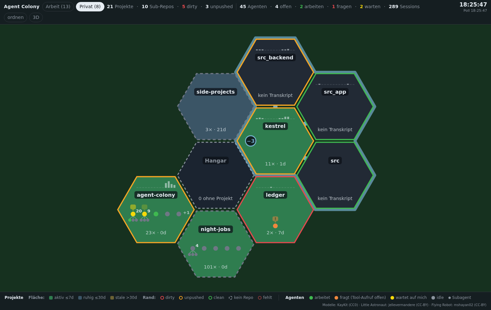
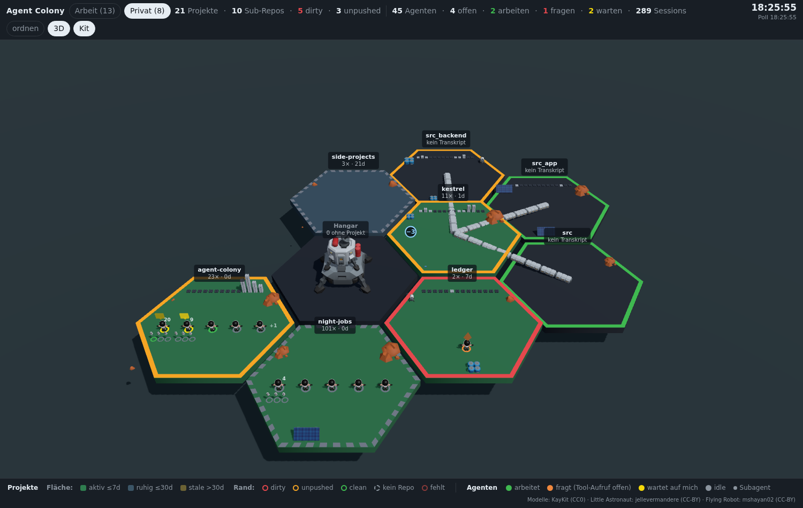

# Agent Colony

Eine Hex-Karte über alle Claude-Code-Projekte auf deiner Maschine. Jedes
Git-Repo, in dem Claude Code je gearbeitet hat, ist ein Feld; jede Session
eine Figur darauf. Ein Blick zeigt, wo gerade gearbeitet wird, wo ein Agent
auf deine Antwort wartet und wo Änderungen uncommittet liegen.



*Alle Bildschirmfotos in dieser Datei zeigen pseudonymisierte Beispieldaten.*

## Wozu

Wer mit Claude Code arbeitet, hat schnell mehr als eine Session offen. Zwei
Projekte parallel, in jedem ein paar Subagenten, dazu ein Worktree für den
Branch nebenan. Ab einem Dutzend Terminal-Tabs stellt sich immer dieselbe
Frage: Wer wartet gerade auf mich? Und gleich danach: Wo habe ich gestern
Abend etwas liegen lassen?

Ein Tab-Stapel beantwortet das nicht, eine Tabelle auch nicht gut. Eine
Fläche schon, weil das Auge ein gelbes Feld unter zwanzig grünen schneller
findet, als es zwanzig Zeilen liest. Agent Colony ist ein Dashboard mit
Spielgrammatik: die Waben sind Beiwerk, der Trick ist, Zustand auf eine
Landkarte zu legen.

## Was du bekommst

- Ein Feld je Git-Repo. Die Füllung sagt, wann dort zuletzt ein Agent
  gearbeitet hat, der Rand den Git-Zustand: rot bei uncommitteten
  Änderungen, gelb bei nicht gepushten Commits, grün wenn nichts zu tun ist.
- Eine Figur je Session, die Subagenten daran. Vier Zustände: arbeitet,
  fragt (eine Permission-Abfrage oder eine Frage an dich), wartet auf dich,
  idle.
- Sub-Repos als angeflanschte Waben. Ein Ordner mit sieben Deployment-Repos
  wird zur Familie, die sich mit einem Klick zu- und wieder aufklappen lässt.
- Eine Skyline über jedem Namen: ein Balken je Kalendertag für die Commits
  der letzten 14 Tage.
- Ein Panel je Feld mit Pfad, Branch, Sessions, Agenten und einem Sprung
  nach VS Code. Wer Obsidian nutzt, bekommt dazu einen Link auf die passende
  Notiz.
- Ein Klick auf eine Agentenzeile öffnet deren Session als Tab in VS Code —
  im Fenster, das den Ordner schon offen hat, sonst in einem neuen. Damit ist
  der Weg von „da wartet jemand" bis „geantwortet" ein Klick lang.
- Planeten als frei konfigurierbare Gruppen, etwa Arbeit und Privat.
- Dieselbe Kolonie als 3D-Szene, auf Knopfdruck, wahlweise mit Modellen
  statt Primitiven.
- Keinen eigenen Zustand. Die App liest `~/.claude/` und deine Repos,
  schreibt nichts und hält keine Datenbank. Löschst du sie, fehlt nichts.



## Voraussetzungen

- Claude Code auf derselben Maschine. Die Karte liest die Transkripte unter
  `~/.claude/projects/`.
- Linux, auch unter WSL. Ob eine Session noch lebt, prüft die App über
  `/proc`. Ohne das gilt jede Session als beendet: Figuren können dann
  arbeiten oder idle sein, aber nie warten oder fragen. macOS wird nicht
  unterstützt, die Skripte unter `scripts/` brechen dort ab.
- Node 20 oder neuer mit npm, dazu Git, Bash, `ss` (Paket iproute2) und
  `curl` auf dem PATH.

## Schnellstart

```bash
git clone https://github.com/aploe/agent-colony.git
cd agent-colony
./scripts/install.sh
```

Das Skript prüft zuerst alle Voraussetzungen und nennt jede, die fehlt.
Danach installiert es die Abhängigkeiten mit `npm ci`, legt
`config/colony.local.json` an und startet den Server im Hintergrund. Die
Karte läuft dann unter http://localhost:4173. Ob die Status-Hooks
eingetragen werden sollen, fragt es nach (siehe „Status-Hooks"); `--hooks`
oder `--no-hooks` beantworten die Frage vorab, `--no-start` lässt den Server
aus. Ein zweiter Lauf fasst eine vorhandene lokale Config nicht an.

```bash
./scripts/install.sh --uninstall   # Hooks austragen, Server beenden
```

`node_modules` und die lokale Config bleiben dabei liegen. Wer alles
entfernen will, löscht danach den Ordner.

Ohne das Skript geht es mit `npm install` und `npm start`; der Server läuft
dann, solange das Terminal offen ist. `./scripts/start-server.sh` startet ihn
im Hintergrund und ersetzt einen Agent-Colony-Server, der schon auf dem Port
läuft. Belegt ein anderes Programm den Port, bricht das Skript ab, statt es
zu beenden. `COLONY_PORT=4180 ./scripts/start-server.sh` weicht auf einen
anderen Port aus, `./scripts/stop-server.sh` beendet den Server wieder.

Ohne lokale Config liest die Karte `~/.claude/projects` und legt alle Repos
auf einen einzigen Planeten namens „Kolonie". Gibt es den Ordner nicht,
sagt der Server das beim Start. Eigene Gruppen und alles, was nur für deine
Maschine gilt, gehören in `config/colony.local.json`. Die Datei ist
gitignoriert und überschreibt die Vorgaben aus `config/colony.config.json`,
und zwar je Schlüssel als Ganzes: wer `planets` setzt, setzt alle Planeten.
Nur `thresholds` wird Wert für Wert zusammengeführt. `install.sh` schreibt
`claudeProjectsDir`, `ignorePaths` und unter WSL `wslDistro` hinein, die
Planeten ergänzt du von Hand:

```json
{
  "claudeProjectsDir": "/home/du/.claude/projects",
  "wslDistro": "Ubuntu",
  "planets": [
    { "id": "arbeit", "label": "Arbeit", "theme": "mars",  "prefixes": ["/home/du/work"] },
    { "id": "privat", "label": "Privat", "theme": "earth", "prefixes": [] }
  ],
  "ignorePaths": ["/home/du"]
}
```

Der letzte Planet fängt alles auf, was zu keinem Präfix passt. `wslDistro`
braucht nur, wer unter WSL arbeitet und aus dem Panel heraus VS Code öffnen
will; ohne den Wert gibt es keinen Link statt eines falschen — und keinen
Klick auf eine Agentenzeile, denn beides führt über dieselbe Distro. `ignorePaths`
nimmt Verzeichnisse von der Karte, die kein Projekt sind, typischerweise das
Home selbst. Alle weiteren Schlüssel stehen unter „Konfiguration".

`npm run collect` schreibt den erhobenen Zustand als JSON auf die Konsole.
Das ist der schnellste Weg zu sehen, was die Karte sehen würde, ganz ohne
Browser.

## Die Karte lesen

Die Füllung eines Feldes ist Aktivität, der Rand ist Git. Für eine dritte
Farbe ist auf der Karte kein Platz; alles Weitere steht im Panel.

| Fläche | Bedeutung |
|---|---|
| grün | aktiv: ein Agent hat hier in den letzten 7 Tagen gearbeitet |
| blaugrau | ruhig: höchstens 30 Tage her |
| oliv, zugewachsen | stale: länger als 30 Tage |
| hohl | kein Transkript: ein Sub-Repo, das nie eine eigene Session hatte |

| Rand | Bedeutung |
|---|---|
| rot | dirty, uncommittete Änderungen |
| gelb | unpushed, oder ein Branch ohne Upstream |
| grün | clean |
| grau gestrichelt | kein Repo, also auch nichts aufzuräumen |
| dunkelrot | das Verzeichnis existiert nicht mehr, die Sessions schon |

Dirty schlägt unpushed schlägt clean, weil uncommittete Änderungen der
einzige Zustand sind, in dem Arbeit verloren gehen kann.

| Figur | Bedeutung |
|---|---|
| grün | arbeitet: der letzte Record ist jünger als 3 Minuten |
| orange mit `!` | fragt: Permission-Abfrage, Frage an dich, oder ein Tool-Aufruf ohne Antwort |
| gelb mit Sprechblase | wartet auf dich: der Turn ist beendet, seitdem kam keine Reaktion |
| grau | idle |
| klein, am Stiel | Subagent, unter der Hauptsession, die ihn gestartet hat |

Orange schlägt grün: eine offene Abfrage darf nie wie Arbeit aussehen. Gelb
und orange gibt es nur für Sessions, deren Claude-Prozess nachweislich noch
lebt. Ist der Prozess weg, bleibt die Figur grau, egal was das Transkript
zuletzt sagt. Blasse Punkte sind Sessions, die in einem Scratchpad gestartet
wurden und nur über dessen Pfadkodierung einem Feld zugeordnet sind.

Subagenten hängen unter ihrer Hauptsession. Die Zahl daneben ist ihre echte
Anzahl, gezeichnet werden höchstens sechs. Sie zählen nie als „wartet auf
mich", weil ihnen ihr Parent antwortet; orange dürfen sie sein, ihre
Permission-Abfragen landen bei dir. `+N` am Ende einer Reihe heißt, dass N
weitere Gruppen nicht mehr aufs Feld passen.

Die Skyline über dem Namen zeigt einen Balken je Kalendertag, 14 Tage, heute
rechts, die Höhe gemessen am stärksten Tag aller Projekte. Hover zeigt Datum
und Zahl. Die Zeile unter dem Namen nennt die Sessions insgesamt und die
Tage seit der letzten Aktivität.

Ein Sub-Repo und sein Elternfeld bilden eine Familie. Eine helle Silhouette
zeichnet ihren Außenrand nach, eine kurze Brücke verbindet Parent und Kind.
Der runde Chip am Container zeigt die Zahl der Kinder und klappt die Familie
auf oder zu. Zugeklappt übernimmt der Container den schlechtesten
Git-Zustand seiner Kinder, damit das Zuklappen nicht genau den Zustand
versteckt, wegen dem es die Kinder gibt. Hover über den Chip hebt die
Familie hervor und zeigt bei einer zugeklappten Familie als blassen Umriss,
wo die Kinder nach dem Klick stehen würden.

Jede Familie merkt sich ihre Zelle im Browser und behält sie über Polls und
Reloads hinweg. Die Karte ordnet sich nur um, wenn ein Feld deutlich von dem
Ring abweicht, den sein Gewicht vorschlägt, und seit der letzten Umordnung
eine Sperrfrist vergangen ist; dann als kurze Fahrt statt als Sprung. Der
Knopf „ordnen" tut dasselbe sofort.

Der Hangar in der Mitte sammelt Agenten, die sich keinem Feld zuordnen
lassen. Ein voller Hangar heißt meistens, dass `ignoreCwdPrefixes` oder die
Pfadauflösung nachjustiert werden will.

## Bedienung

In 2D verschiebt Ziehen die Karte, das Rad zoomt um den Cursor, ein Klick
auf eine Wabe öffnet das Panel, ein Doppelklick zoomt hinein und ein
Doppelklick ins Leere zurück zur Übersicht. Zoomwechsel laufen als kurze
Bewegung; wer währenddessen zieht oder scrollt, bricht sie ab.

In 3D dreht Ziehen mit der linken Taste, Ziehen mit der rechten schiebt, das
Rad zoomt zum Cursor, Klick wählt aus, Doppelklick fährt hin. Die Neigung ist
auf 25 bis 70 Grad begrenzt, unter die Karte schaut man nie. Rauszoomen
endet knapp hinter der Übersicht der sichtbaren Kolonie; weiter draußen
bliebe von der Welt nur ein Fleck auf einer Kugel.

Die Knöpfe oben: „ordnen" ordnet die Karte einmal neu, „3D" wechselt den
Renderer, „Kit" (nur in 3D) tauscht Primitive gegen Modelle. Renderer und
Skin bleiben im Browser gemerkt.

## Status-Hooks

Ohne Hooks rät die Karte den Zustand einer Session aus dem Transkript: aus
dem Alter des letzten Records und daraus, ob ein Tool-Aufruf ohne Antwort
offen ist. Das reicht, um wartende Sessions zu finden, aber ein Agent, der
vier Minuten nachdenkt, sieht dann aus wie idle. Mit Hooks meldet jede
Session ihren Zustand selbst.

```bash
node scripts/install-hooks.mjs             # eintragen
node scripts/install-hooks.mjs --uninstall
```

`./scripts/install.sh --hooks` ruft denselben Installer auf.

Der Installer registriert acht Ereignisse global in `~/.claude/settings.json`.
Hooks im Repo selbst würden nur in Sessions dieses Projekts feuern, die Karte
will aber alle. Das Hook-Skript bleibt im Repo, der Eintrag zeigt mit
absolutem Pfad darauf; wer das Repo verschiebt, führt den Installer erneut
aus. Aus einem Worktree heraus verweigert er den Lauf, weil ein Worktree
wegwerfbar ist und der Eintrag danach still ins Leere zeigen würde. Wirksam
ab der nächsten Session; gemeldete Figuren tragen im Panel die Marke
„gemeldet". Sind die Einträge schon da, schreibt ein weiterer Lauf nichts,
und `--uninstall` ohne Einträge legt auch keine `settings.json` an.

Der Hook ist ein Bash-Skript, das je Ereignis eine kleine JSON-Datei unter
`${XDG_RUNTIME_DIR:-/tmp}/agent-colony/` schreibt und beim Sessionende wieder
löscht. Es endet unter allen Umständen mit Exit 0 und blockiert nie einen
Turn. Ob eine Session lebt, entscheidet weiterhin die Karte selbst, über die
Prozess-Registry von Claude Code und `/proc`.

Wer den Eintrag lieber von Hand setzt, hängt für jedes der acht Ereignisse
eine eigene Matcher-Gruppe an das jeweilige Array an. Bestehende Gruppen
anderer Werkzeuge bleiben unangetastet; genau so arbeitet auch der
Installer, und `--uninstall` entfernt nur Gruppen, deren Kommando auf das
eigene Skript zeigt.

```json
{
  "hooks": {
    "SessionStart":      [ { "matcher": "", "hooks": [ { "type": "command", "command": "bash /pfad/zu/agent-colony/hooks/session-status.sh SessionStart" } ] } ],
    "UserPromptSubmit":  [ { "matcher": "", "hooks": [ { "type": "command", "command": "bash /pfad/zu/agent-colony/hooks/session-status.sh UserPromptSubmit" } ] } ],
    "Notification":      [ { "matcher": "", "hooks": [ { "type": "command", "command": "bash /pfad/zu/agent-colony/hooks/session-status.sh Notification" } ] } ],
    "PermissionRequest": [ { "matcher": "", "hooks": [ { "type": "command", "command": "bash /pfad/zu/agent-colony/hooks/session-status.sh PermissionRequest" } ] } ],
    "Stop":              [ { "matcher": "", "hooks": [ { "type": "command", "command": "bash /pfad/zu/agent-colony/hooks/session-status.sh Stop" } ] } ],
    "SubagentStart":     [ { "matcher": "", "hooks": [ { "type": "command", "command": "bash /pfad/zu/agent-colony/hooks/session-status.sh SubagentStart" } ] } ],
    "SubagentStop":      [ { "matcher": "", "hooks": [ { "type": "command", "command": "bash /pfad/zu/agent-colony/hooks/session-status.sh SubagentStop" } ] } ],
    "SessionEnd":        [ { "matcher": "", "hooks": [ { "type": "command", "command": "bash /pfad/zu/agent-colony/hooks/session-status.sh SessionEnd" } ] } ]
  }
}
```

Zwei Dinge kann der Hook nicht sehen. Für „Erlaubnis erteilt" gibt es kein
Ereignis, und für eine Frage an dich (`AskUserQuestion`, Plan-Freigabe) auch
keins. Beides liefert weiterhin das Transkript: die Frage über den offenen
Tool-Aufruf, die erteilte Erlaubnis über einen Zeitstempel-Vergleich zwischen
der Abfrage und dem nächsten Tool-Aufruf danach.

## 3D-Ansicht

Der Knopf „3D" zeigt dieselbe Kolonie als Szene, mit denselben Farben: die
Plattform trägt die Aktivität, die Leuchtkante den Git-Zustand.
Kinder-Repos liegen eine Stufe tiefer als ihr Hauptordner, der Steg
dazwischen ist eine Rampe. Über einer Figur, die wartet, schwebt ein Kasten,
über einer mit offenem Tool-Aufruf ein Kegel. Graue Kisten und das Raster
bedeuten nichts; alles, was leuchtet, bedeutet etwas.

Die Figuren laufen: wer arbeitet, wartet oder fragt, geht langsam in seiner
Wabe umher und weicht Bauten, Gelände und den anderen aus; wer idle ist,
geht zu seinem Platz und setzt sich. Eine neue Session läuft einmal vom
Hangar zu ihrem Projekt. Im Kit schwingen Arme und Beine im Takt des Wegs,
die Astronauten tragen ein Gesicht, das mit dem Zustand wechselt, und wer
idle ist, sitzt auf dem Boden seiner Wabe. Die Drohnen der Subagenten
fliegen selbst: arbeitend kreisen sie um ihren Kopf und fliegen ab und zu
zu einem Bau der Wabe, den sie mit einem Lichtkegel abtasten. Eine fragende
Drohne schwebt schräg vor dem Visier, eine idle landet vor dem Platz ihres
Kopfes, und eine neue schießt aus seinem Rucksack. Nichts davon ist ein Signal;
den Zustand tragen weiter Ring, Hologramm und Farbe.

„Kit" tauscht die Primitive gegen Modelle: KayKit Space Base Bits für
Gelände und Bauten, dazu zwei Figuren von Sketchfab. Layout und Signale
bleiben dabei gleich. Die Lizenzen stehen in `public/assets/kit/LICENSES.md`,
die Nennungen in der Legende: KayKit (CC0), Little Astronaut von
jellevermandere (CC-BY 4.0), Flying Robot von mshayan02 (CC-BY 4.0).

Der Boden trägt dabei eine Palette je Planet (Konfiguration `ground`) mit
prozeduralem Rauschen als Relief, dazu eine stumme Streuung rund um die
Kolonie: Kulisse ohne eigenes Signal, nie anklickbar. Jede Palette streut
anderes. Die Wiese hat Gras, Büsche, Bäume und einen Strand mit Palmen, die
Wüste Dünen, Schotter und trockene Büschel, die Eisebene Gletscherbrocken
und ein zugefrorenes Meer mit Löchern darin, die Marsfläche Findlinge und
Staub. Jede Wabe sitzt auf einem Sockel in Bodenfarbe, der bis zur Platte
reicht.

Die Welt ist gekrümmt. Um den Punkt, den die Kamera ansieht, fällt der Boden
nach allen Seiten ab wie auf einem kleinen Planeten; wer ein Feld am Rand
heranholt, hat es oben. Die Waben bleiben ebene Platten und das Raster ein
Raster, die Krümmung ist Kulisse und gilt in beiden Skins. Titel, Klick und
Hover sitzen trotzdem auf der Wabe, die man sieht.

Beide Ansichten teilen Layout, Zustand und Panel. Wer umschaltet, behält
Auswahl, Planet und zugeklappte Familien; nur der Blickpunkt geht verloren.
Schlägt der Import von three.js fehl, etwa ohne `npm install`, fällt die
Karte auf 2D zurück und schreibt den Grund in die Konsole.

Der Knopf „Kit" ist nur sichtbar, solange 3D aktiv ist, und merkt sich
wie der Modus im Browser (`localStorage`-Schlüssel `colony.skin`).


## Konfiguration

Die Vorgaben stehen in `config/colony.config.json`, alles
Maschinenspezifische in `config/colony.local.json`. Die Tabelle nennt alle
Schlüssel, auch die ohne Vorgabe in der eingecheckten Datei. Eine lokale
Datei, die kein gültiges JSON-Objekt ist, lässt Server und Collector mit dem
Dateinamen abbrechen, statt still auf die Vorgaben zurückzufallen.

| Schlüssel | Bedeutung |
|---|---|
| `claudeProjectsDir` | Pfad zu den Transkripten von Claude Code. Ohne Wert gilt `~/.claude/projects`; fehlt der Ordner, warnt der Server beim Start |
| `port` | Port des Servers, Vorgabe 4173. `--port N` oder `COLONY_PORT` überstimmen ihn, `--port 0` nimmt einen freien und nennt ihn in der Startzeile |
| `host` | Adresse, an die der Server bindet, Vorgabe `127.0.0.1`: nur der eigene Rechner erreicht die Karte, unter WSL auch der Windows-Browser über `localhost`. Eine andere Adresse, etwa `0.0.0.0`, macht `/api/state` mit allen Pfaden, Branches und Aufgaben für jeden lesbar, der sie erreicht; der Server warnt dann beim Start |
| `pollSeconds` | Poll-Intervall des Browsers, Vorgabe 5 |
| `gitCacheSeconds` | Wie lange Git-Ergebnisse gelten, Vorgabe 20 |
| `planets` | Gruppen mit `id`, `label`, `theme` (`earth` oder `mars`), Pfad-`prefixes` und `ground` (Bodenpalette der 3D-Ansicht im Kit-Skin: `rost`, `gruen`, `blau` oder `gelb`; fehlt der Schlüssel, gilt `theme === 'mars' ? 'rost' : 'gruen'`); der letzte Planet fängt den Rest. Vorgabe: ein Planet `kolonie` für alles |
| `thresholds` | `activeDays` 7, `quietDays` 30, `freshSessionDays` 14, `agentWorkingMinutes` 3, `agentPromptMinutes` 1, `agentWaitingMinutes` 90, `agentDropHours` 24 |
| `subRepos` | `depth` 2, `maxSatellites` 12, `skipDirs` (etwa `node_modules`) |
| `reorder` | `ringDelta` 2, `cooldownSeconds` 60, `animateMs` 400 |
| `ignoreDirs` | Kodierte Ordnernamen unter `~/.claude/projects`, die nie ein Feld werden |
| `ignorePaths` | Volle Pfade, die nie ein Feld werden, etwa das Home |
| `ignoreCwdPrefixes` | Pfad-Präfixe, die bei der Zuordnung von Agenten übersprungen werden, etwa Scratchpads |
| `wslDistro` | WSL-Distro für den VS-Code-Link im Panel und das Öffnen einer Session; ohne Wert kein Link und kein Klick. `install.sh` übernimmt ihn aus `WSL_DISTRO_NAME` |
| `vscodeCli` | Pfad zur `code`-CLI, falls die Suche unter `~/.vscode-server/bin/*/bin/remote-cli/code` fehlschlägt. Normalerweise leer |
| `vaultPath`, `vaultName`, `projectsDir`, `noteMapping` | Obsidian-Vault und Notizordner für den optionalen Notiz-Link; `noteMapping` ordnet Repo-Pfaden Notiztitel zu, sonst gilt der Name |
| `hookStatusDir` | Ort der Hook-Statusdateien, nur für den Leser. Vorgabe `${XDG_RUNTIME_DIR:-/tmp}/agent-colony` |

## Wie es funktioniert

Ein Collector auf reiner Node-Standardbibliothek erhebt bei jedem Refresh
den Zustand und liefert ihn als JSON unter `/api/state`. Der Browser pollt
alle 5 Sekunden, rechnet das Layout selbst und zeichnet: 2D auf einem
Canvas, 3D mit three.js. Es gibt keinen Build und keinen Bundler. Die
Browser-Abhängigkeiten (three, Shoelace für die Hover-Cards) kommen direkt
aus `node_modules` über eine Importmap.

In der Vorgabe lauscht der Server nur auf `127.0.0.1` (Schlüssel `host`).
Er hat weder Login noch Verschlüsselung, und `/api/state` verrät, woran auf dem Rechner gearbeitet
wird. Unter WSL im NAT-Modus reicht die Weiterleitung von `localhost` auf
der Windows-Seite trotzdem bis zu ihm; ein Aufruf über die WSL-IP geht
dagegen nicht mehr.

| Quelle | Liefert |
|---|---|
| `~/.claude/projects/<kodierter Pfad>/` | Felder, Session- und Subagenten-Zahlen, letzte Aktivität aus dem jüngsten Record im Transkript, nicht aus der Datei-mtime |
| `…/subagents/*.jsonl` und `*.meta.json` | Subagenten als kleine Figuren, ihr Name und ihre Aufgabe |
| `~/.claude/sessions/<pid>.json` gegen `/proc/<pid>/stat` | Ob der Claude-Prozess einer Session noch lebt |
| `${XDG_RUNTIME_DIR:-/tmp}/agent-colony/` | Optional der von der Session selbst gemeldete Zustand (Status-Hooks) |
| `git status`, `rev-list`, `log` je Repo | Rand und Skyline |
| Notizen im Obsidian-Vault | Nur ein optionaler Link, steuert nichts |

Ein Feld ist ein Git-Repo-Root. Ein Worktree oder ein Unterverzeichnis
desselben Repos wird zusammengelegt und erscheint im Panel unter „Auch"; ein
echtes Sub-Repo mit eigenem Git-Verzeichnis wird zur Kind-Wabe. Entdeckt
werden Sub-Repos bis Tiefe 2 unterhalb eines Feldes, das bereits eine
Session hatte, mit einem Deckel von 12 je Feld.

Claude Code kodiert das Startverzeichnis einer Session als Ordnernamen und
ersetzt dabei `/`, `_` und `.` durch `-`. Das ist nicht umkehrbar:
`team-websites` und `team/websites` ergeben beide `-team-websites`. Die Karte
löst deshalb in zwei Richtungen auf. Zuerst vom cwd im Transkript aufwärts,
bis die Kodierung eines Vorfahren auf den Ordnernamen passt. Scheitert das,
etwa weil eine Session nur Scratchpad-Pfade kennt, dann vom Dateisystem
abwärts entlang der Zweige, deren Kodierung ein Präfix des Zielnamens ist.

Git ist die teuerste Quelle. Seine Ergebnisse leben 20 Sekunden im Cache,
ein einzelner Aufruf bricht nach 5 Sekunden ab, und der Server hält eine
Erhebung für die halbe Poll-Zeit vor, damit mehrere Tabs sie nicht
vervielfachen.

Was nicht ermittelbar ist, steht als `null` im State und als „—" im Panel,
nicht als plausibel klingende Zahl. Lieber ein Feld weniger als ein Feld
mit geratenen Daten.

## Bekannte Grenzen

- Ohne Status-Hook ist der Agentenzustand heuristisch. Ob eine Session
  offen ist, ist immer sicher; was sie gerade tut, wird aus dem Transkript
  abgeleitet. Subagenten bleiben auch mit Hook heuristisch, weil ihre
  Hook-Ereignisse keinen Zustand tragen.
- Orange kann ohne Hook ein lang laufendes Tool sein. Ein Bash-Lauf von
  vier Minuten sieht im Transkript aus wie eine Permission-Abfrage; deshalb
  steht im Panel „unbeantworteter Tool-Aufruf", nicht „Permission".
  `Agent`, `Monitor`, `Workflow` und `TaskOutput` sind ausgenommen, weil sie
  per Definition lange laufen.
- Im Auto-Mode feuert `PermissionRequest` auch für Kommandos, die sofort
  erlaubt werden. Orange ist dann nur Sekundenbruchteile sichtbar.
- Sessions aus einem anderen `~/.claude`, etwa von der Windows-Seite unter
  WSL, haben hier weder Transkript noch Registry-Eintrag und fehlen komplett.
- Der Rand eines Feldes mit Worktrees zeigt den Zustand des Hauptrepos,
  nicht den des Worktrees.
- Git läuft pro Repo pro Refresh. Bei vielen Feldern ist das der erste
  Engpass.
- Die Zuordnung über Scratchpad-Pfade ist ein Präfix-Vergleich und kann bei
  gleich kodierten Pfaden falsch liegen.
- Ein Repo ohne vorherige Session erscheint nie, auch nicht als Kind eines
  Feldes, das selbst keine Session hatte. Die Karte zeigt Arbeitsorte, nicht
  das Dateisystem. Ein entdecktes Sub-Repo entdeckt selbst nichts weiter.
- Tiefe 2 ist eine Wette auf die übliche Ordnerstruktur. Tiefe 3 fand in
  einem Test statt 10 gleich 64 Kinder, davon 54 Extension-Klone unter einem
  einzigen Feld. Der Wert steht deshalb in der Config.
- Die Umordnung misst nur den Ring der Wurzel; Kinderplätze sind nicht
  verankert und können sich zwischen zwei Polls drehen. Bei wenigen Feldern
  greift die Ringschwelle praktisch nie von selbst, dann hilft der Knopf
  „ordnen".

## Entwickeln und prüfen

```bash
npm test                                                  # Fixture-Tests: Hook, Installer, Leser, decideState
npm run collect | head -60                                # erhobener Zustand als JSON
npm start -- --port 0                                     # zweiter Server auf einem freien Port
node scripts/drive.mjs shot kolonie out.png               # Screenshot über einen eigenen Wegwerf-Server
node scripts/drive.mjs shot kolonie out.png --mode 3d --skin kit
node scripts/drive.mjs run mein-szenario.mjs --planet kolonie
```

Ohne lokale Config gibt es nur den Planeten `kolonie`. `drive.mjs` bricht
bei einem unbekannten Planeten ab und nennt die vorhandenen; ohne
`--planet` zeigt es den ersten.

`scripts/drive.mjs` startet je Lauf einen eigenen Server auf einem freien
Port, fährt headless Chromium dagegen und beendet nur die eigene PID.
Playwright ist absichtlich keine Projekt-Dependency; das Skript sucht
`playwright-core` in `node_modules` oder in der globalen npm-Installation
und Chromium unter `~/.cache/ms-playwright/`.

Die Fixture-Tests decken reine Funktionen ab. Alles, was aus `~/.claude`
oder einem Repo liest, wird gegen Echtdaten geprüft, weil jeder bisher
gefundene Fehler aus der Realität der Daten kam: ein Scratchpad ohne Anker,
ein Worktree, ein Transkript mit 9 MB. Nach jeder Änderung am Renderer wird
das Bild angesehen; ein korrekter State allein beweist nichts.

`git config core.hooksPath scripts/git-hooks` schaltet einen Leak-Check vor
Commit und Push ein (`scripts/leak-check.mjs`): Er weist Pfade zurück, die in
ein persönliches Arbeitsverzeichnis gehören, und auf Wunsch Zeilen, die
Muster aus einer privaten Liste treffen.

## Herkunft

Ausgangspunkt war ein Reel von @jarrenrocks: eine Hex-Kolonie auf einem
Planeten, ein Feld pro Projekt, jede Figur ein Agent, blockierte Agenten mit
leuchtender Sprechblase. Übernommen wurde die Einsicht dahinter, dass
räumliche Abstraktion bei zweistelliger Agentenzahl besser skaliert als jede
Liste. Nicht übernommen wurde die Engine: keine Isometrie, kein
Planetenflug. Die 3D-Ansicht kam später dazu, zuerst aus Primitivgeometrie,
dann mit dem Modell-Kit; laufende Figuren und Gesichter, anfangs bewusst
weggelassen, folgten mit dem Kit.
