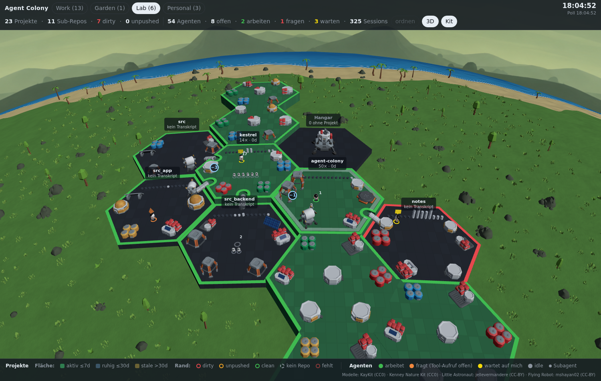
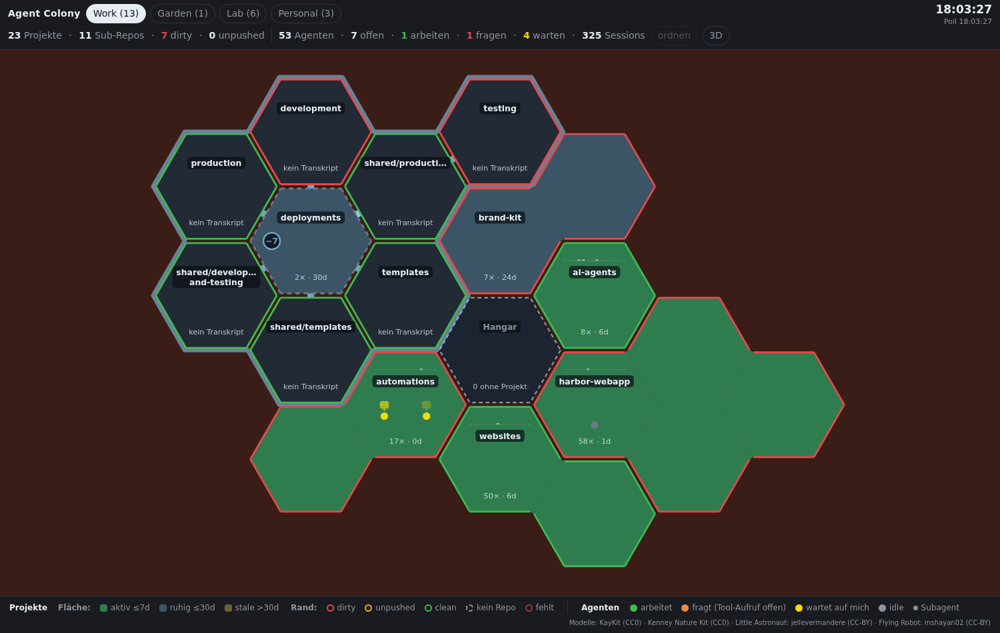

# Agent Colony

Which Claude Code session is waiting for you right now? Agent Colony answers
that with a live map of every project on your machine: one hexagon per repo,
one figure per session, and a glowing sign over every agent that needs you.



*All screenshots show pseudonymized demo data.*

## The problem

Claude Code is fast enough that one session stops being enough. You start a
second one for the bug that came in, a third in a worktree for the branch
next door, and each of them hands work to subagents. By lunchtime there are
twelve terminal tabs, and they all look the same.

Somewhere in that stack an agent has been sitting on a permission prompt for
forty minutes. Another one finished an hour ago and is waiting for your
answer. And in a repo you touched yesterday evening, three files are still
uncommitted. None of this is hidden, exactly. It is just spread over tabs,
scrollback and `git status` output that nobody looks at until it hurts.

A list does not fix it either. Twenty rows of session names ask you to read,
and reading is the slow part.

## What Agent Colony does

It puts that state on a surface. Your eye finds one yellow field among twenty
green ones faster than it scans twenty lines, so the map is built around a
few colours that each mean exactly one thing:

- A figure under a **yellow** sign has finished its turn and waits for you.
  An **orange** one is asking: a permission prompt, a question, or a tool
  call without an answer.
- The border of a field is Git. Red means uncommitted changes, yellow means
  commits that never left the machine.
- The fill is activity: green for work in the last week, fading to blue-grey
  and then to an overgrown olive.

When you spot the yellow sign, click the agent in the side panel. Its session
opens as a tab in VS Code, in the window that already has the folder open, or
in a new one. From "someone is waiting" to typing the answer is one click.



Everything runs locally. The map reads `~/.claude/` and your repositories and
writes nothing back; there is no database and no cloud service behind it.
Delete it and nothing is missing.

What else is on the map:

- Sub-repos attach to their parent as a family that folds with one click. A
  folder with seven deployment repos becomes one field until you open it.
- A skyline above each name shows commits per day for the last 14 days.
- Planets group projects the way you think about them, for example work and
  personal.
- The same colony as a 3D scene on a small, curved planet. Astronauts walk
  their field, subagents fly as drones, and on the meadow palette the sea
  lies behind the colony. Switching views keeps selection and folded
  families.

The interface is German for now; an English version is planned.

## Requirements

- Claude Code on the same machine. The map reads the transcripts under
  `~/.claude/projects/`.
- Linux, including WSL. Whether a session is still alive is checked through
  `/proc`; without it every session counts as closed, and figures can work or
  idle but never wait or ask. macOS is not supported, the scripts under
  `scripts/` stop there.
- Node 20 or newer with npm, plus Git, Bash, `ss` (package iproute2) and
  `curl` on the PATH.

## Quick start

```bash
git clone https://github.com/aploe/agent-colony.git
cd agent-colony
./scripts/install.sh
```

The script checks all requirements first and names every one that is
missing. Then it installs the dependencies with `npm ci`, creates
`config/colony.local.json` and starts the server in the background. The map
runs at http://localhost:4173. It asks whether to install the status hooks
(see "Status hooks"); `--hooks` or `--no-hooks` answer that in advance, and
`--no-start` skips the server. Running it again leaves an existing local
config alone.

```bash
./scripts/install.sh --uninstall   # remove the hooks, stop the server
```

`node_modules` and the local config stay where they are. To remove
everything, delete the folder afterwards.

Without the script, `npm install` and `npm start` work too; the server then
runs as long as the terminal stays open. `./scripts/start-server.sh` starts it
in the background and replaces an Agent Colony server already running on the
port. If another program holds the port, the script stops instead of killing
it. `COLONY_PORT=4180 ./scripts/start-server.sh` moves to another port, and
`./scripts/stop-server.sh` stops the server again.

Without a local config the map reads `~/.claude/projects` and puts every repo
on a single planet called "Kolonie". If that folder does not exist, the
server says so at startup. Your own groups and everything specific to your
machine belong in `config/colony.local.json`. The file is gitignored and
overrides the defaults from `config/colony.config.json` key by key as a
whole: whoever sets `planets` sets all planets. Only `thresholds` is merged
value by value. `install.sh` writes `claudeProjectsDir`, `ignorePaths` and,
under WSL, `wslDistro`; planets you add by hand:

```json
{
  "claudeProjectsDir": "/home/you/.claude/projects",
  "wslDistro": "Ubuntu",
  "planets": [
    { "id": "work",     "label": "Work",     "theme": "mars",  "prefixes": ["/home/you/work"] },
    { "id": "personal", "label": "Personal", "theme": "earth", "prefixes": [] }
  ],
  "ignorePaths": ["/home/you"]
}
```

The last planet catches everything that matches no prefix. `wslDistro` is
only needed under WSL, for the VS Code link in the panel and for opening a
session with a click; without it there is no link rather than a wrong one.
`ignorePaths` keeps folders off the map that are not projects, usually the
home directory itself. All other keys are listed under "Configuration".

`npm run collect` prints the collected state as JSON. That is the quickest way
to see what the map would see, without a browser.

## Reading the map

The fill of a field is activity, the border is Git. There is no room for a
third colour on the map; everything else is in the panel.

| Fill | Meaning |
|---|---|
| green | active: an agent worked here in the last 7 days |
| blue-grey | quiet: at most 30 days ago |
| olive, overgrown | stale: longer than 30 days |
| hollow | no transcript: a sub-repo that never had a session of its own |

| Border | Meaning |
|---|---|
| red | dirty, uncommitted changes |
| yellow | unpushed, or a branch without upstream |
| green | clean |
| grey, dashed | not a repository, so nothing to clean up |
| dark red | the folder no longer exists, its sessions do |

Dirty beats unpushed beats clean, because uncommitted changes are the only
state in which work can get lost.

| Figure | Meaning |
|---|---|
| green | working: the last record is younger than 3 minutes |
| orange with `!` | asking: a permission prompt, a question for you, or a tool call without an answer |
| yellow with speech bubble | waiting for you: the turn has ended and nothing happened since |
| grey | idle |
| small, on a stem | subagent, below the main session that started it |

Orange beats green: an open prompt must never look like work. Yellow and
orange only appear for sessions whose Claude process is provably alive. Once
the process is gone the figure stays grey, whatever the transcript said last.
Pale dots are sessions started in a scratchpad and assigned to a field only
through that path's encoding.

Subagents hang below their main session. The number next to them is their
real count; at most six are drawn. They never count as "waiting for you"
because their parent answers them, but they can be orange, since their
permission prompts reach you. `+N` at the end of a row means N more groups do
not fit on the field.

The skyline above a name has one bar per calendar day, 14 days, today on the
right, scaled to the busiest day across all projects. Hovering shows date and
count. The line below the name gives the total number of sessions and the
days since the last activity.

A sub-repo and its parent form a family. A light silhouette traces its outer
edge, a short bridge links parent and child. The round chip on the container
shows the number of children and folds the family in or out. When folded, the
container takes on the worst Git state of its children, so folding never hides
the very state the children are there to show. Hovering the chip highlights
the family and, for a folded one, draws a faint outline where the children
would appear after the click.

Every family remembers its cell in the browser and keeps it across polls and
reloads. The map only rearranges when a field is clearly off the ring its
weight suggests and a cooldown has passed since the last rearrangement, and
then as a short animation rather than a jump. The button "ordnen" (arrange)
does the same immediately.

The hangar in the middle collects agents that cannot be assigned to any
field. A full hangar usually means `ignoreCwdPrefixes` or the path resolution
needs adjusting.

## Controls

In 2D, dragging pans the map, the wheel zooms around the cursor, a click on a
field opens the panel, a double click zooms in and a double click on empty
space returns to the overview. Zoom changes run as a short animation; dragging
or scrolling during it cancels it.

In 3D, left drag rotates, right drag pans, the wheel zooms towards the cursor,
a click selects and a double click flies there. Tilt is limited to 25 to 70
degrees, so you never look under the map. Zooming out stops just beyond an
overview of the visible colony; further out the world would only be a speck
on a sphere.

The buttons at the top: "ordnen" rearranges the map once, "3D" switches the
renderer, "Kit" (3D only) swaps primitives for models. Renderer and skin are
remembered in the browser.

## Status hooks

Without hooks the map infers a session's state from its transcript: from the
age of the last record and from whether a tool call is waiting for an answer.
That is enough to find waiting sessions, but an agent thinking for four
minutes then looks idle. With hooks, every session reports its own state.

```bash
node scripts/install-hooks.mjs             # install
node scripts/install-hooks.mjs --uninstall
```

`./scripts/install.sh --hooks` calls the same installer.

The installer registers eight events globally in `~/.claude/settings.json`.
Hooks in the repository itself would only fire in sessions of this project,
and the map wants all of them. The hook script stays in the repository and
the entry points to it with an absolute path; if you move the repository, run
the installer again. It refuses to run from a worktree, because a worktree is
disposable and the entry would silently point nowhere afterwards. It takes
effect from the next session on; reporting figures carry the tag "gemeldet"
(reported) in the panel. If the entries already exist, another run writes
nothing, and `--uninstall` without entries does not create a `settings.json`.

The hook is a Bash script that writes a small JSON file per event under
`${XDG_RUNTIME_DIR:-/tmp}/agent-colony/` and deletes it when the session
ends. It always exits with 0 and never blocks a turn. Whether a session is
alive is still decided by the map itself, through Claude Code's process
registry and `/proc`.

If you prefer to set the entry by hand, append a separate matcher group to
the array of each of the eight events. Existing groups of other tools stay
untouched; the installer works the same way, and `--uninstall` only removes
groups whose command points to its own script.

```json
{
  "hooks": {
    "SessionStart":      [ { "matcher": "", "hooks": [ { "type": "command", "command": "bash /path/to/agent-colony/hooks/session-status.sh SessionStart" } ] } ],
    "UserPromptSubmit":  [ { "matcher": "", "hooks": [ { "type": "command", "command": "bash /path/to/agent-colony/hooks/session-status.sh UserPromptSubmit" } ] } ],
    "Notification":      [ { "matcher": "", "hooks": [ { "type": "command", "command": "bash /path/to/agent-colony/hooks/session-status.sh Notification" } ] } ],
    "PermissionRequest": [ { "matcher": "", "hooks": [ { "type": "command", "command": "bash /path/to/agent-colony/hooks/session-status.sh PermissionRequest" } ] } ],
    "Stop":              [ { "matcher": "", "hooks": [ { "type": "command", "command": "bash /path/to/agent-colony/hooks/session-status.sh Stop" } ] } ],
    "SubagentStart":     [ { "matcher": "", "hooks": [ { "type": "command", "command": "bash /path/to/agent-colony/hooks/session-status.sh SubagentStart" } ] } ],
    "SubagentStop":      [ { "matcher": "", "hooks": [ { "type": "command", "command": "bash /path/to/agent-colony/hooks/session-status.sh SubagentStop" } ] } ],
    "SessionEnd":        [ { "matcher": "", "hooks": [ { "type": "command", "command": "bash /path/to/agent-colony/hooks/session-status.sh SessionEnd" } ] } ]
  }
}
```

Two things the hook cannot see. There is no event for "permission granted",
and none for a question to you (`AskUserQuestion`, plan approval). Both still
come from the transcript: the question through the open tool call, the
granted permission through a timestamp comparison between the prompt and the
next tool call after it.

## 3D view

The "3D" button shows the same colony as a scene, with the same colours: the
platform carries activity, the glowing edge carries the Git state. Child repos
sit one level below their parent, joined by a ramp. A box floats over a
waiting figure, a cone over one with an open tool call. Grey crates and the
grid mean nothing; everything that glows means something.

The figures move. Whoever works, waits or asks walks slowly around their field
and steps around buildings, terrain and each other; whoever is idle walks to
their spot and sits down. A new session walks once from the hangar to its
project. In the kit, arms and legs swing with the steps, the astronauts wear a
face that changes with their state, and idle ones sit on the ground of their
field. Subagent drones fly on their own: while working they circle their
astronaut and now and then fly to a building on the field to scan it with a
cone of light. An asking drone hovers at an angle in front of the visor, an
idle one lands in front of its astronaut's spot, and a new one shoots out of
the backpack. None of this is a signal; the state stays with ring, hologram
and colour.

"Kit" swaps the primitives for models: KayKit Space Base Bits for terrain and
buildings, plants from the Kenney Nature Kit, and two figures from Sketchfab.
Layout and signals stay the same. Licenses are in
`public/assets/kit/LICENSES.md`, credits in the legend: KayKit (CC0), Kenney
(CC0), Little Astronaut by jellevermandere (CC-BY 4.0), Flying Robot by
mshayan02 (CC-BY 4.0).

The ground carries a palette per planet (configuration `ground`) with
procedural noise as relief, plus silent scenery around the colony that has no
signal and is never clickable. Each palette scatters something else. The
meadow has grass, bushes, trees and a beach with palms, the desert dunes,
gravel and dry tufts, the ice plain glacier chunks and a frozen sea with holes
in it, the Mars surface boulders and dust. Every field stands on a plinth in
ground colour that reaches down to the plate.

The world is curved. Around the point the camera looks at, the ground falls
away on all sides like on a small planet; pull a field from the edge closer
and it comes out on top. Fields stay flat plates and the grid stays a grid;
the curvature is scenery and applies to both skins. Titles, clicks and hover
still sit on the field you see.

Both views share layout, state and panel. Switching keeps selection, planet
and folded families; only the viewpoint is lost. If importing three.js fails,
for example without `npm install`, the map falls back to 2D and logs the
reason to the console.

The "Kit" button is only visible while 3D is active and, like the mode, is
remembered in the browser (`localStorage` key `colony.skin`).

## Configuration

Defaults live in `config/colony.config.json`, everything machine-specific in
`config/colony.local.json`. The table lists all keys, including those without
a default in the committed file. A local file that is not a valid JSON object
makes server and collector stop with the file name instead of silently
falling back to the defaults.

| Key | Meaning |
|---|---|
| `claudeProjectsDir` | Path to Claude Code's transcripts. Without a value `~/.claude/projects` applies; if the folder is missing, the server warns at startup |
| `port` | Server port, default 4173. `--port N` or `COLONY_PORT` override it, `--port 0` picks a free one and names it in the startup line |
| `host` | Address the server binds to, default `127.0.0.1`: only your own machine reaches the map, under WSL also the Windows browser via `localhost`. Another address such as `0.0.0.0` makes `/api/state` with all paths, branches and tasks readable for anyone who reaches it; the server then warns at startup |
| `pollSeconds` | Browser poll interval, default 5 |
| `gitCacheSeconds` | How long Git results stay valid, default 20 |
| `planets` | Groups with `id`, `label`, `theme` (`earth` or `mars`), path `prefixes` and `ground` (ground palette of the 3D kit skin: `rost`, `gruen`, `blau` or `gelb`; without the key, `theme === 'mars' ? 'rost' : 'gruen'` applies); the last planet catches the rest. Default: one planet `kolonie` for everything |
| `thresholds` | `activeDays` 7, `quietDays` 30, `freshSessionDays` 14, `agentWorkingMinutes` 3, `agentPromptMinutes` 1, `agentWaitingMinutes` 90, `agentDropHours` 24 |
| `subRepos` | `depth` 2, `maxSatellites` 12, `skipDirs` (such as `node_modules`) |
| `reorder` | `ringDelta` 2, `cooldownSeconds` 60, `animateMs` 400 |
| `ignoreDirs` | Encoded folder names under `~/.claude/projects` that never become a field |
| `ignorePaths` | Full paths that never become a field, such as the home directory |
| `ignoreCwdPrefixes` | Path prefixes skipped when assigning agents, such as scratchpads |
| `wslDistro` | WSL distro for the VS Code link in the panel and for opening a session; without a value there is no link and no click. `install.sh` takes it from `WSL_DISTRO_NAME` |
| `vscodeCli` | Path to the `code` CLI, in case the search under `~/.vscode-server/bin/*/bin/remote-cli/code` fails. Usually empty |
| `vaultPath`, `vaultName`, `projectsDir`, `noteMapping` | Obsidian vault and notes folder for the optional note link; `noteMapping` maps repo paths to note titles, otherwise the name is used |
| `hookStatusDir` | Location of the hook status files, for the reader only. Default `${XDG_RUNTIME_DIR:-/tmp}/agent-colony` |

## How it works

A collector on the plain Node standard library gathers the state on every
refresh and serves it as JSON at `/api/state`. The browser polls every 5
seconds, computes the layout itself and draws: 2D on a canvas, 3D with
three.js. There is no build step and no bundler. The browser dependencies
(three, Shoelace for the hover cards) come straight from `node_modules`
through an import map.

By default the server listens on `127.0.0.1` only (key `host`). It has
neither login nor encryption, and `/api/state` reveals what is being worked
on. Under WSL in NAT mode, forwarding of `localhost` from the Windows side
still reaches it; a request through the WSL IP no longer does.

| Source | Provides |
|---|---|
| `~/.claude/projects/<encoded path>/` | Fields, session and subagent counts, last activity from the newest record in the transcript rather than the file mtime |
| `…/subagents/*.jsonl` and `*.meta.json` | Subagents as small figures, their name and task |
| `~/.claude/sessions/<pid>.json` checked against `/proc/<pid>/stat` | Whether a session's Claude process is still alive |
| `${XDG_RUNTIME_DIR:-/tmp}/agent-colony/` | Optionally the state a session reported itself (status hooks) |
| `git status`, `rev-list`, `log` per repo | Border and skyline |
| Notes in an Obsidian vault | Only an optional link, controls nothing |

A field is a Git repository root. A worktree or a subfolder of the same repo
is merged into it and listed in the panel under "Auch" (also); a real sub-repo
with its own Git directory becomes a child field. Sub-repos are discovered up
to depth 2 below a field that already had a session, capped at 12 per field.

Claude Code encodes a session's start folder as a directory name and replaces
`/`, `_` and `.` with `-`. That cannot be reversed: `team-websites` and
`team/websites` both become `-team-websites`. The map therefore resolves in
two directions. First upwards from the cwd in the transcript, until the
encoding of an ancestor matches the folder name. If that fails, for instance
because a session only knows scratchpad paths, it walks down the file system
along the branches whose encoding is a prefix of the target name.

Git is the most expensive source. Its results live in a cache for 20
seconds, a single call gives up after 5 seconds, and the server keeps one
collection for half the poll time so that several tabs do not multiply it.

Whatever cannot be determined is `null` in the state and a dash in the
panel, never a plausible-looking number. Better one field less than a field with
guessed data.

## Known limits

- Without the status hook the agent state is heuristic. Whether a session is
  open is always certain; what it is doing is inferred from the transcript.
  Subagents stay heuristic even with the hook, because their hook events carry
  no state.
- Without the hook, orange can be a long-running tool. A four-minute Bash run
  looks like a permission prompt in the transcript, which is why the panel
  says "unbeantworteter Tool-Aufruf" (unanswered tool call) rather than
  permission. `Agent`, `Monitor`, `Workflow` and `TaskOutput` are excluded
  because they run long by definition.
- In auto mode, `PermissionRequest` also fires for commands that are allowed
  immediately. Orange is then visible for a fraction of a second.
- Sessions from another `~/.claude`, such as the Windows side under WSL, have
  neither transcript nor registry entry here and are missing entirely.
- The border of a field with worktrees shows the state of the main repo, not
  that of the worktree.
- Git runs per repo per refresh. With many fields that is the first
  bottleneck.
- Assignment through scratchpad paths is a prefix comparison and can be wrong
  for paths that encode the same way.
- A repo without a previous session never appears, not even as the child of a
  field that had no session itself. The map shows places of work, not the
  file system. A discovered sub-repo discovers nothing further.
- Depth 2 is a bet on the usual folder structure. In one test, depth 3 found
  64 children instead of 10, 54 of them extension clones under a single
  field. The value is therefore in the config.
- Rearranging only measures the ring of the root; child positions are not
  anchored and can rotate between two polls. With few fields the ring
  threshold hardly ever triggers on its own; then the "ordnen" button helps.

## Development

```bash
npm test                                                  # fixture tests: hook, installer, readers, decideState, leak check
npm run collect | head -60                                # collected state as JSON
npm start -- --port 0                                     # a second server on a free port
node scripts/drive.mjs shot kolonie out.png               # screenshot through a throwaway server of its own
node scripts/drive.mjs shot kolonie out.png --mode 3d --skin kit
node scripts/drive.mjs run my-scenario.mjs --planet kolonie
```

Without a local config there is only the planet `kolonie`. `drive.mjs` stops
on an unknown planet and names the existing ones; without `--planet` it shows
the first.

`scripts/drive.mjs` starts a server of its own on a free port for each run,
drives headless Chromium against it and stops only its own PID. Playwright is
deliberately not a project dependency; the script looks for `playwright-core`
in `node_modules` or in the global npm installation, and for Chromium under
`~/.cache/ms-playwright/`.

The fixture tests cover pure functions. Everything that reads from
`~/.claude` or a repo is checked against real data, because every bug found
so far came from the reality of the data: a scratchpad without an anchor, a
worktree, a 9 MB transcript. After every renderer change someone looks at the
image; a correct state alone proves nothing.

`git config core.hooksPath scripts/git-hooks` turns on a leak check before
commit and push (`scripts/leak-check.mjs`). It rejects paths that belong in a
personal working folder and, optionally, lines and commit identities matching
patterns from a private list.

## Origin

The starting point was an Instagram reel by @jarrenrocks: a hex colony on a
planet, one field per project, every figure an agent, blocked agents under a
glowing speech bubble. What carried over is the idea behind it, that spatial
abstraction scales better than any list once agents reach double digits. The
engine did not: no isometric view, no flight between planets. The 3D view came
later, first from primitive geometry, then with the model kit; walking figures
and faces, left out on purpose at first, followed with the kit.

## License

[PolyForm Internal Use License 1.0.0](LICENSE). You may use Agent Colony and
adapt it for yourself, also inside your company for internal work. You may not
distribute it, changed or unchanged, and so you may not sell it either. This
is deliberately not an open source license. The models and images under
`public/assets/` have their own licenses, listed in the `LICENSES.md` files
next to them.
